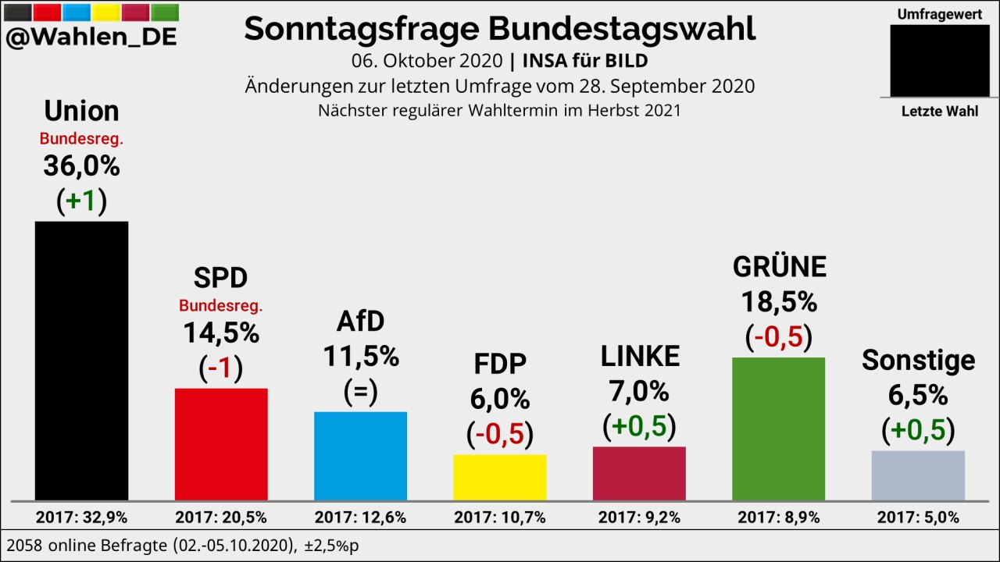

# Bestandsaufnahme der politischen Landkarte

Die SPD hat mit der Doppelspitze aus Saskia Esken und Norbert-Walter Borjans zwei Personen, die der Öffentlichkeit weitestgehend unbekannt waren \(44% der Menschen kenne den Vizevorsitzenden, obwohl er zuvor Finanzminister in NRW war\). Beide versuchen vor allem durch Rherotik der Partei ein deutlich linkeres Profil zu geben. Bekannterer Wortführer ist Kevin Kühnert, der durch seine Rolle als Nicht-Vorsitzender mehr Freiheit zu Polarisierung hat. Die Bundestagsfraktion kann dem Kurs nur bedingt folgen. Als Kanzlerkandidat wurde Olaf Scholz gewählt, der in seiner Rolle als Finanzminister, in der er der gesamtdeutschen Bevölkerung verpflichtet ist, und nicht nur den SPD-Mitgliedern, sich nur schwer entlang der SPD-Parteilinie positionieren kann. Weitere SPD-Minister, insbesondere Hubertu Heil, versuchen jedoch diese deutlicher zu betonen, indem sie mit Positionen bzw Gesetzesentwürfen versuchen, sich von der CDU abzugrenzen. 

Die CDU profitiert von der Schwäche der SPD dahingehend, als dass sie in der Regierungskoalition tonangebend sein kann. Nach dem Rückzug von Angela Merkel muss Frau Kramp-Karrenbauer sich auf den letzten Monaten ihrer Amtszeit behaupten. Eine regelmäßige und umfangreiche Diskussion ist über die Kanzlerfrage in der Union entbrannt, in die sich Markus Söder \(CSU\) immer wieder versucht einzubringen. Weitere Kandidaten sind Friedrich Merz, Armin Laschet mit Jens Spahn, und Norbert Röttgen. Die Politik der CDU ist von Vorstößen einzelner Politiker geprägt, die Aufmerksamkeit erregen \(möchten\), weniger jedoch von dem, was allgemeinhin von der CDU erwartet wird. Auch hier macht sich unter der klassischen CDU-Klientel die Unzufriedenheit breit. Während der Corona-Krise wurde aber durch entschlossenes Handeln viel Zustimmung in der Bevölkerung gewonnen.

Die Grünen sind nach wie vor stark, da das Thema ökologischer Nachhaltigkeit immer noch in der Bevölkerung als dringlich empfunden wird, und dies auch ein klarer Handlungszwang für zukünftige Regierungspartien wird. Aufgrund ihres bisherigen Images und der Positonierung sind die Grünen weitestgehend der Natürlcihe Stimm-Empfänger. Auch wenn sich unter den jungen Aktivisten Unzufriedenheit breit macht. Es steht zu erwarten, dass alle demokratischen Parteien auf den Protest eingehen werden, und Maßnahmen zur Einhaltung des 1,5-Grad-Zieles im Rahmen des Wahlkampfes präsentieren werden. Vor dem Hintergrund, dass die Menge der Wahlberechtigten unter diesen Aktiven eher gering ist, verglichen mit den älteren Generationen, die über Jahre hinweg mit den Grünen als dem glaubwürdigsten Vertreter einer ökologisch nachhaltigen Politik begleitet wurden, ist die Ausrichtung der Partei hin zu einer Volkspartei schlüssig und erfolgreich. Beim Bundesparteitag im November stehen so auch im Rahmen der Neufassung des Grundsatzprogramms auch ein Bekenntnis zur NATO im Programm. 

Die FDP bemüht sich nach wie vor redlich um Aufmerksamkeit. Politische Impulse der FDP fehlen oder schaffen es nicht in die Öffentlichkeit. Zerstrittenheit über den Antritt von Thomas Kemmerich als Ministerpräsident in Thüringen wirkte sich negativ auf das Image aus und erhöhte die Angreifbarkeit. Eine der Allgemeinheit nicht zu vermittelnde frühe Opposition gegen die Coronona-Maßnahmen unterstützte das Image der FDP als Anti-Partei, anstatt als Gestalter. Nach einem Jahr als Generalsekretärin wurde Linda Teuteberg zum Rücktritt bewogen, so dass nach wie vor der Fokus in der Partei auf Christian Lindner liegt, der nun verstärkt unter Erfolgsdruck hinsichtlich der Bundestagswahl 2021 steht. Ein Nicht-Einzug wird daher seinen Rücktritt als Vorsitzender bedeuten. Ein öffentlicher Streit um die Nachfolge ist jedoch nicht entbrannt. Im Rahmen der Nachwahl von Volker Wissing als neuen Generalsekretär fiel Christian Lindner durch einen unangebrachten Herrenwitz auf. Mögliche gute Programmanträge ginge daher hinter diesem Lapsus unter.  

Die Die Linke tritt noch weniger als die FDP in Erscheinung. Das ist jedoch für die Partei nicht unbedingt ein Nachteil, da ihr Regierungsstreben auf Bundesebene auch ohnehin wenig ausgeprägt ist. Die beiden Parteivorsitzenden Katja Kipping und Bernd Riexinger sind nach acht Jahren zurückgetreten, und die Vorstandswahl steht bevor. 

Als Neu-Einzug im Bundestag ist die AfD vor allem lästig, indem sie regelmäßig versucht, die Arbeit des Bundestags zu sabotieren. Inhaltliche Impulse fehlen. Die letzten Wahlen scheinen das Bild zu bestätigen, dass die Partei mit einem Stimmanteil von 10-12% vertreten sein wird. Innerparteilich vertieft sich die Kluft zwischen dem nun offiziell aufgelösten rechten Flügel und dem Rest der Partei. Einerseits greifen immer mehr Vertreter des Flügels nach Vorstandsposten in den westlichen Landesverbänden, andererseits kommt es zur offenbarung klar rechtsradikaler Tendenzen, die von Parteiausschlussverfahren begleitet werden. In wieweit das zu einem Abschlag bei den Zustimmungswerten bei Wählern führt, ist schlecht abzuschätzen. 

Vor allem auf kommunaler Ebene treten in unterschiedlicher Stärke die Freien Wähler auf, die je Gliederung und Region unterschiedliche Ziele vertreten.

Es gibt eine Fülle kleinerer Parteien, die als Glücksritter zu Wahlen antreten. Keine dieser Parteien ist jedoch in der Situation auf Bundesebene oder Landesebene in parlamentarische Repräsentation zu kommen. Einige dieser Parteien sind dem Spektrum nach den PIRATEN ähnlich, andere nicht. In Teilen inhaltliche Überschneidungen gibt es bei den Humanisten, den Neuen Liberalen, den Unabhängigen, der V-Partei, Demokratie in Bewegung und weiteren.

Eine Initiative United4Bundestag versucht, die Aktivisten aus der Klimabewegung mit den Kleinparteien zusammenzubringen und zu vereinen, [da der gemeinsame rechnerische Stimmenanteil über 5% liegt und somit ein Einzug in den Bundestag wahrscheinlich erscheinen würde.](https://youtu.be/2Weu9TV_XQU) Hierfür müsste sich eine Partei als "Container" für die anderen Parteien und Bewegungen anbieten, um so als Partei für die Wahl anzutreten. Alternativ müsste eine neue Partei als Container gegründet werden. Der Zeitdruck beeinflusst das Vorhaben nicht unbedingt positiv, und eine sehr negative Reaktion der die PARTEI auf die Initiative verlangsamt den Prozess, da gerade diese Partei sich besonders als Container eignen würde. 

### Aktuelle Wahlumfrage:

